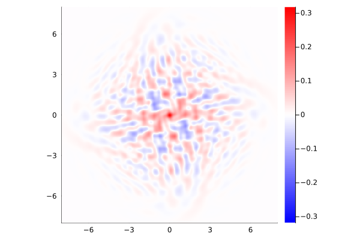
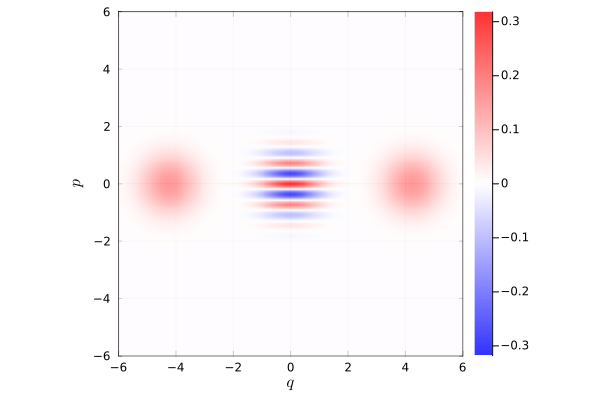

# WignerFunctionPlotting

This code produces plots of single mode Wigner Functions using the Gauss-Laguerre basis.
Here are some examples:

# Quickstart 
A quickstart tutorial is provided in `Quickstart.ipynb`

# License  
MIT